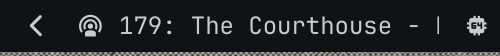
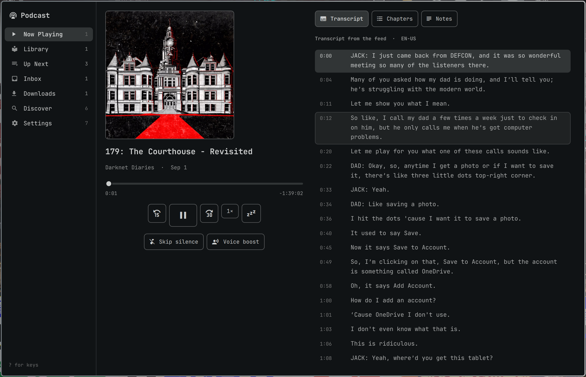
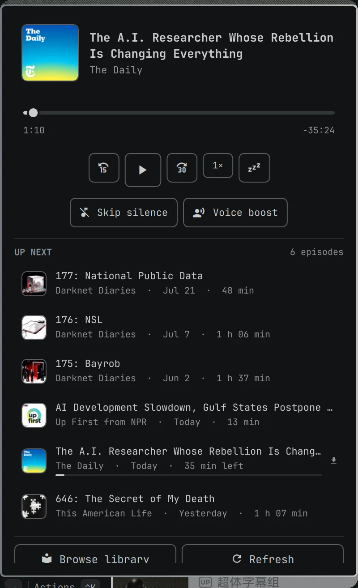
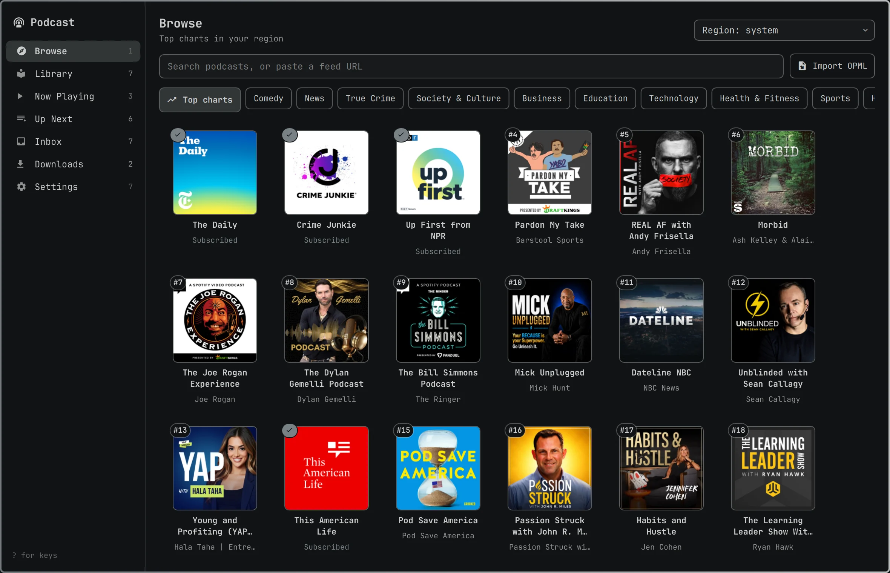
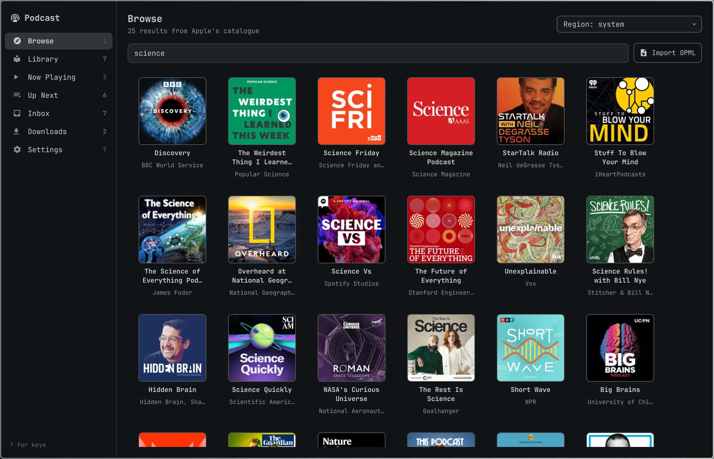
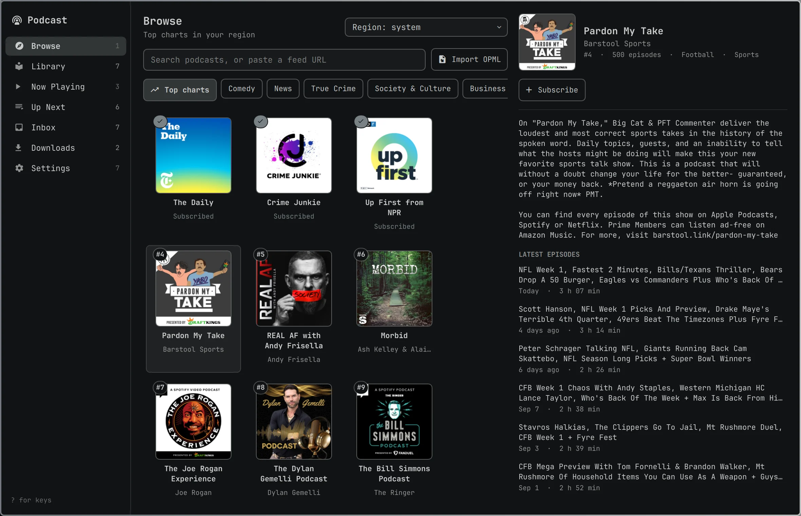
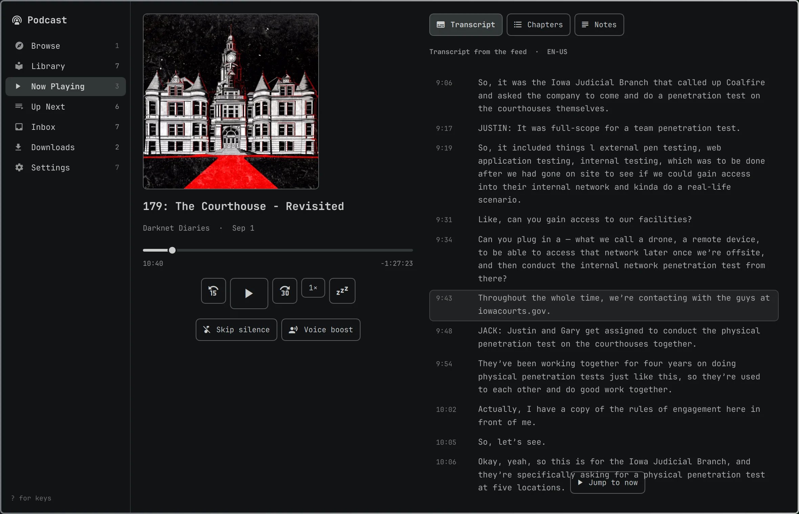
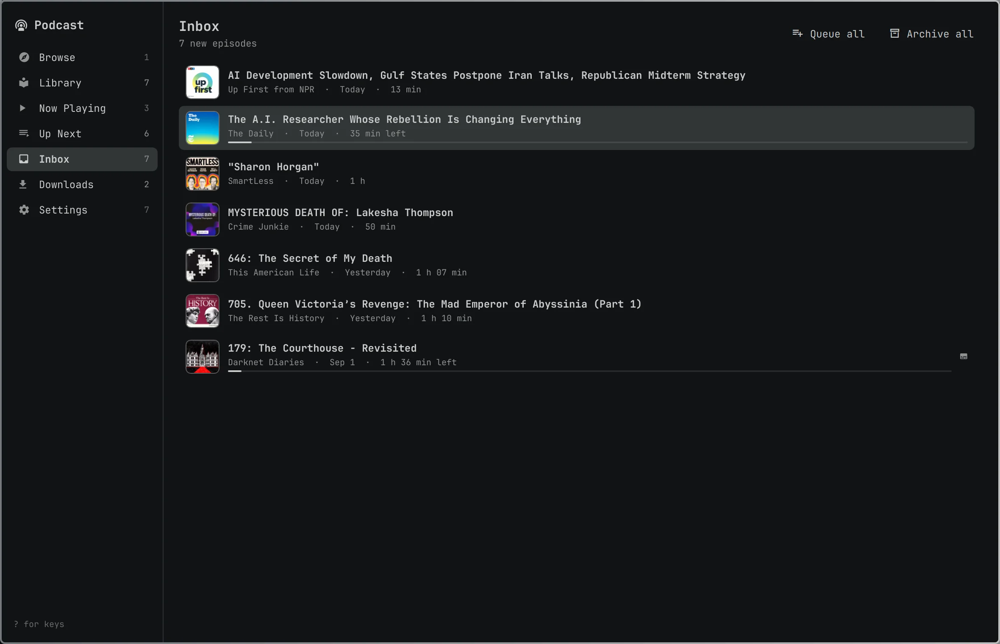
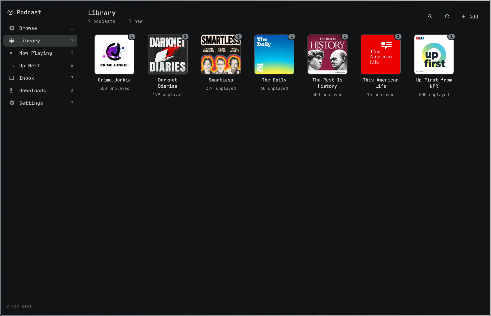
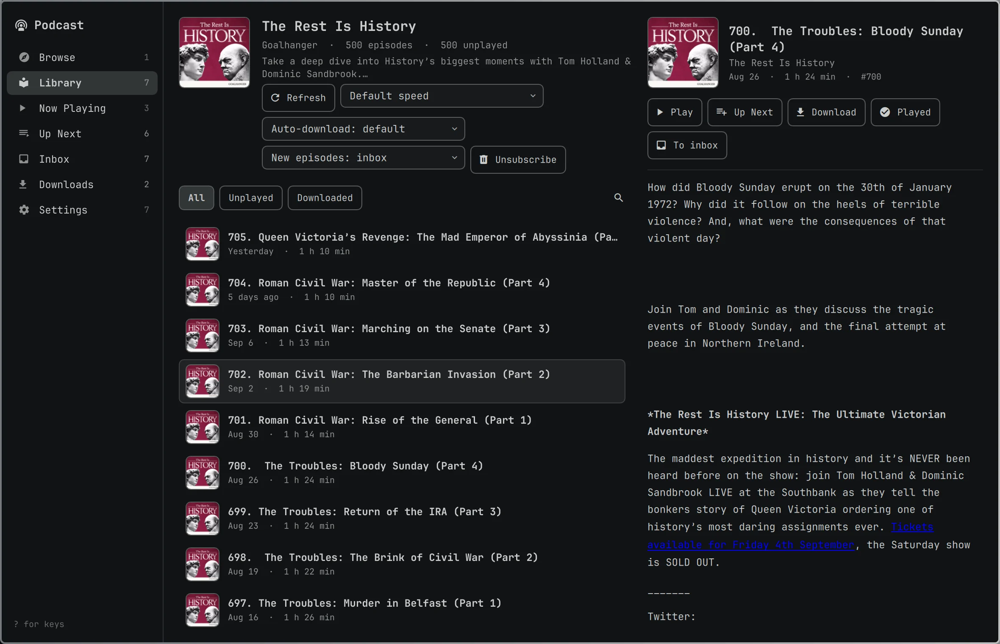

<h1 align="center">Omarchy-Podcast</h1>

<p align="center">
  A native podcast player for the <a href="https://omarchy.org">Omarchy</a> shell —
  a bar widget, a now-playing dropdown, and a launcher-style window that opens on the charts.
<br>
  <sub>by <a href="https://x.com/hominluo">@hominluo</a></sub>
</p>

<p align="center">
  
</p>

<p align="center">
  
</p>

<p align="center">
  <a href="#install">Install</a> ·
  <a href="#browse">Browse</a> ·
  <a href="#listen">Listen</a> ·
  <a href="#the-library">Library</a> ·
  <a href="#the-bar-and-the-dropdown">Bar & dropdown</a> ·
  <a href="#transcripts">Transcripts</a> ·
  <a href="#sync">Sync</a> ·
  <a href="#settings">Settings</a> ·
  <a href="#notes">Notes</a>
</p>

---

Open the window and the top podcasts for your region are already there — by
genre, searchable as you type, subscribable with one key. Everything else a
podcast player should do is here too: an Up Next queue, an inbox for new
episodes, downloads for offline listening, chapters, per-podcast speed,
silence skipping, voice boost, a sleep timer, transcripts that follow the
audio (from the feed, or made on your own machine with whisper.cpp), and sync
with gpodder.net or Nextcloud. It is drawn with your Omarchy theme, driven
from the keyboard, and plays through `mpv`, so the media keys and Omarchy's
own media widget just work.

| | |
|---|---|
| **Browse** | Apple's top 50 for your region, overall or in any of 19 genres — no account, no key. Search the catalogue as you type, paste any feed URL, or import an OPML file. |
| **Show pages before you subscribe** | Description and the latest episodes in a pane on the right; `s` subscribes. |
| **Listen** | Up Next, an inbox that only shows what is new, resume everywhere, chapters on the seek bar, per-podcast speed, silence skipping, voice boost, a sleep timer that fades out. |
| **Transcripts** | The feed's own (VTT, SRT, JSON, HTML, text) or a local whisper.cpp run on your GPU — highlighted and kept in view as the audio plays, searchable, click to seek. |
| **Offline** | Downloads with resume, automatic for the newest episode of each show, cleaned up after they are played. |
| **Sync** | gpodder.net or Nextcloud GPodder Sync: subscriptions and positions, both ways. |
| **Native** | One `mpv` on MPRIS, one stdlib-only Python engine that survives shell restarts, QML that only ever reads state — and every colour, spacing and font from your theme. |

## Install

```bash
omarchy pkg add mpv mpv-mpris ffmpeg whisper-cpp ggml-vulkan
omarchy plugin add https://github.com/hominluo/Omarchy-Podcast.git --enable
omarchy bar move io.github.hominluo.podcast --before omarchy.audio
```

| Dependency | Needed for | Notes |
|---|---|---|
| `mpv`, `mpv-mpris` | playback | already part of Omarchy; `mpv-mpris` is what puts the player on the media keys |
| `ffmpeg` | cover art, transcription | already part of Omarchy |
| `whisper-cpp` | local transcripts | optional; the feed's own transcripts work without it |
| `ggml-vulkan` | transcription on the GPU | optional; on an AMD/Intel/NVIDIA card this is the difference between real time and ten to twenty times faster |
| `python3` | the engine | already on every Arch install; the engine uses the standard library only |

The plugin lands disabled so you can read it first (`omarchy plugin add` without
`--enable`), and it is enabled by putting its widget on the bar.

To remove it:

```bash
omarchy plugin remove io.github.hominluo.podcast
```

Your library stays in `~/.local/state/omarchy/podcast/` and downloads in
`~/Music/Podcasts/` until you delete them.

## The bar and the dropdown

The bar shows a podcast glyph and, while something plays, the episode title
scrolling beside it.

| Interaction | Result |
|---|---|
| left click | open the now-playing dropdown |
| middle click | play / pause |
| right click | open the library window |
| scroll wheel | seek 15 s (turn off in settings) |
| media keys | play/pause, next, previous — through MPRIS, like any player |

<p align="center">
  
</p>

The dropdown holds the artwork, the seek bar with chapter notches, skip back /
play / skip forward, the speed and sleep-timer chips, the silence-skipping and
voice-boost toggles, the first few episodes of Up Next, and the way into the
window.

| Key | Result |
|---|---|
| `Space` | play / pause |
| `h` `l` / `←` `→` | skip back / forward (or move along a row of buttons) |
| `j` `k` / `↑` `↓` | move the cursor |
| `Enter` | activate the cursor |
| `s` / `S` | faster / slower |
| `z` | sleep timer: off → default → 45 → 60 min → end of episode → end of chapter |
| `x` | remove the Up Next row under the cursor |
| `b` `q` `i` `t` `/` | open the window on Library / Up Next / Inbox / Now Playing / Browse |
| `r` | refresh every feed |
| `Tab` | move to the next bar panel |
| `Esc` | close |

Bind a key to it if you like (`~/.config/hypr/bindings.lua`):

```lua
o.bind("SUPER + SHIFT + P", "Podcast", "omarchy-shell shell toggle io.github.hominluo.podcast '{}'")
```

That opens the window. For the dropdown use
`omarchy-shell io.github.hominluo.podcast.panel toggle`.

## Browse

<p align="center">
  
</p>

The window opens on **Browse**: the top podcasts for your region, straight
from Apple's charts, with a strip of genres above the grid — Comedy, News,
True Crime, Society & Culture, Business, Technology and the rest. `H` / `L`
step through them, `r` reloads, and the region menu in the corner switches
storefronts (it follows your locale by default). With a Podcast Index key a
**Trending** chip appears too.

<p align="center">
  
</p>

Type and the grid becomes search results as you type. Paste a feed URL
instead and `Enter` reads that feed; **Import OPML** takes a whole list.

<p align="center">
  
</p>

`Enter` (or a click) opens a show in the pane on the right with its
description and latest episodes. **Subscribe** — or `s` from the grid — adds
it to the library; the feed read for the preview is reused, so it is instant.
Subscribed shows carry a tick on their tile.

## Listen

<p align="center">
  
</p>

**Now Playing** has the artwork and the controls, with the transcript, the
chapters or the show notes beside them. The current paragraph is highlighted
and kept in view as the audio plays; click any line to jump there.

<p align="center">
  
</p>

**Inbox** holds only what is new. Play an episode, add it to Up Next (`a`,
or `A` to play it next), or archive it (`e`); `Q` queues everything and `E`
archives everything. When you subscribe, only the newest episode lands here —
the back catalogue stays on the show's own page.

**Up Next** is the queue: reorder with `J` / `K`, remove with `x`, and when an
episode ends the next one starts. **Downloads** shows what is on disk and
what is on its way.

## The library

<p align="center">
  
</p>

<p align="center">
  
</p>

Every show has a page with its episodes (all, unplayed, downloaded — or `/`
to filter), its own speed and auto-download settings, and whether new
episodes go to the inbox. An episode opens in the detail pane with play,
Up Next, download, played and archive buttons, then the show notes (links
open in your browser only when you click them) and chapters.

### Keys, everywhere in the window

| Key | Result |
|---|---|
| `1`–`7` | jump to a sidebar view |
| `Tab` / `Shift+Tab` | move between the sidebar, the list and the detail pane |
| `j` `k` / `↑` `↓`, `PgUp` `PgDn`, `Home` `End` | move |
| `Enter` | open the podcast / the episode / play |
| `Space` | play / pause whatever is playing |
| `/` | search or filter the current view |
| `,` `.` | seek back / forward |
| `[` `]` | slower / faster |
| `Backspace` | back |
| `Esc` | close the search → close the detail pane → back → close the window |
| `?` | the full key list for the current view |

On an episode (in a list or in its detail pane): `p` play · `a` add to Up Next
· `A` play next · `d` download or delete · `m` mark played · `e` archive or
move to the inbox · `t` transcript. In Up Next `J` / `K` move the episode and
`x` removes it; in the Inbox `E` archives everything and `Q` queues everything.

Show notes render as text; links open in your browser only when you click them.

## Transcripts

If the feed ships a transcript (`<podcast:transcript>`, in VTT, SRT, JSON, HTML
or plain text), it is fetched the first time you open the Transcript tab. The
current paragraph is highlighted and kept in view; scroll anywhere to read
ahead, `f` or **Jump to now** to follow again, `/` searches with `n` / `N`
between matches, and clicking a paragraph seeks there.

If the feed ships nothing, **Transcribe** runs
[whisper.cpp](https://github.com/ggml-org/whisper.cpp) on your machine. With
the `ggml-vulkan` package installed the GPU does the work — an hour-long
episode takes a few minutes on a modest card; on the CPU alone it takes a while
longer with a smaller model. The model (a few hundred megabytes) downloads on
first use into `~/.cache/omarchy/podcast/models/`, the transcript fills in
paragraph by paragraph while it runs, and nothing leaves your machine.

The models come from one fixed revision of
[ggerganov/whisper.cpp](https://huggingface.co/ggerganov/whisper.cpp/tree/5359861c739e955e79d9a303bcbc70fb988958b1),
commit `5359861c739e955e79d9a303bcbc70fb988958b1`, and every download is
checked against the size and SHA-256 recorded in `engine/transcripts/whisper.py`
before whisper-cli is ever pointed at it:

| Model | File | Size | SHA-256 |
|---|---|---|---|
| `large-v3-turbo` | `ggml-large-v3-turbo-q5_0.bin` | 574 041 195 | `394221709cd5ad1f40c46e6031ca61bce88931e6e088c188294c6d5a55ffa7e2` |
| `small` | `ggml-small-q5_1.bin` | 190 085 487 | `ae85e4a935d7a567bd102fe55afc16bb595bdb618e11b2fc7591bc08120411bb` |
| `base` | `ggml-base-q5_1.bin` | 59 707 625 | `422f1ae452ade6f30a004d7e5c6a43195e4433bc370bf23fac9cc591f01a8898` |
| `tiny` | `ggml-tiny-q5_1.bin` | 32 152 673 | `818710568da3ca15689e31a743197b520007872ff9576237bda97bd1b469c3d7` |

A transfer is capped at the pinned size, resumed only when the server's byte
range agrees with what is already on disk, and hashed in full before it is
renamed into place; a file in the models folder that does not match — from an
older release, or edited by hand — is deleted and fetched again.

The transcription policy in settings can also run it automatically for every
download, or for everything you add to Up Next.

## Sync

Settings → Sync connects to [gpodder.net](https://gpodder.net) or the
[Nextcloud GPodder Sync](https://github.com/thrillfall/nextcloud-gpodder) app.
Subscriptions and playback positions are pushed after every pause and pulled on
an interval, so AntennaPod, Kasts and friends pick up where you left off. The
newer position wins; nothing is ever deleted from disk on the other client's
say-so. The server must be reachable over `https://` — the password travels
with every request — with plain `http://` accepted only for `localhost` (an
SSH tunnel, say). A server that hands back hundreds of subscriptions at once
gets them added two hundred per sync.

## Settings

Everything is on the widget's entry in `~/.config/omarchy/shell.json` — edit it
in the Settings view, with `omarchy bar set io.github.hominluo.podcast <key> <value>`,
or by hand. Keys and defaults:

| Key | Default | What it does |
|---|---|---|
| `skipBack`, `skipForward` | `15`, `30` | seconds for the skip buttons and `h`/`l` |
| `defaultSpeed` | `1.0` | playback speed; podcasts can override it on their own page |
| `continuousPlayback` | `true` | play the next episode in Up Next when one ends |
| `sleepTimerDefault` | `30` | minutes for the first press of the sleep timer |
| `refreshIntervalMin` | `30` | how often feeds are checked |
| `initialInboxCount` | `1` | episodes put in the inbox when you subscribe |
| `notifyNewEpisodes` | `false` | desktop notification when a refresh finds something |
| `downloadDir` | `~/Music/Podcasts` | where downloads go, one folder per podcast |
| `autoDownload` | `latest` | `none`, `latest` (newest per podcast) or `all`; podcasts can override |
| `keepDownloads` | `5` | played downloads kept per podcast before the oldest go |
| `deletePlayedAfterDays` | `7` | delete played downloads after this many days; `0` keeps them |
| `transcriptionPolicy` | `on-demand` | `off`, `on-demand`, `downloaded` or `queued` |
| `whisperDevice`, `whisperModel` | `auto`, `auto` | force the CPU, or a model: `large-v3-turbo`, `small`, `base` |
| `searchProvider` | `itunes` | `itunes` (no key) or `podcastindex` |
| `searchCountry` | `auto` | two-letter country for Apple's catalogue; `auto` follows your locale |
| `syncProvider`, `syncServer`, `syncUsername`, `syncDeviceId`, `syncIntervalMin` | off | see [Sync](#sync); `syncServer` must be `https://` (or `localhost`); the password is entered in the Settings view |
| `showTitle`, `maxLabelWidth`, `barProgress`, `wheelAction` | `true`, `160`, `false`, `seek` | the bar cell |

API keys and the sync password never go into `shell.json`; they are kept in
`~/.config/omarchy/podcast/credentials.json` (mode 0600).

## Notes

Plugins run unsandboxed inside `omarchy-shell`. This one keeps the shell side
small — the widgets and windows are QML that reads state and sends commands —
and does everything else in a separate process, `podcastd.py`, which the shell
starts on demand and which keeps running (and playing) across `omarchy restart
shell`.

What it talks to: the feeds you subscribe to and their artwork hosts;
`itunes.apple.com` (and `rss.marketingtools.apple.com`) for search and the
charts; `api.podcastindex.org` only if you add a key;
`huggingface.co` once per model when you first transcribe; and the sync server
you configure. Nothing is sent anywhere otherwise. Only `http(s)` is ever
fetched, an `https` link is never followed down to plain `http`, and every
response is read under a size cap.

What it runs: `mpv` (with `mpv-mpris`), `ffmpeg`, `whisper-cli`,
`omarchy-notification-send` and `omarchy-launch-browser`. Every command is an
argument list, never a shell string, so a hostile feed title cannot become a
command; ffmpeg and whisper-cli run in their own process groups under a time
limit and are stopped when the daemon restarts. Feed HTML is reduced to a
small safe subset before it is shown, links from feeds open only when you
click them, and only `http(s)` URLs are ever played.

What the shell draws: every image on screen was fetched, checked to be an
image, and re-encoded by the daemon into a bounded JPEG under
`~/.cache/omarchy/podcast/`. The shell process never loads a remote URL or
decodes bytes a feed or a catalogue served — search results and previews go
through the same pipeline into a small thumbnail cache.

Who can talk to it: the daemon listens on a socket in
`$XDG_RUNTIME_DIR/omarchy-podcast/` — a directory only you can enter — and
checks the peer's uid on every connection. Any process running as you can
therefore drive it: subscribe, download into the folder you configured,
export your subscriptions somewhere under your home directory. That is the
boundary every Omarchy plugin lives in; the daemon refuses to start at all
without a private runtime directory (it never falls back to a shared temp
directory), and caps what a single client can hold open or leave unread.

Where it writes: `~/.local/state/omarchy/podcast/` (the library database and
the daemon log, mode 0600, with feed credentials and query strings redacted
from logged URLs), `~/.cache/omarchy/podcast/` (artwork and thumbnails,
transcripts, models, audio fetched only to transcribe), `~/Music/Podcasts/`
(downloads), `~/.config/omarchy/podcast/credentials.json`, and
`$XDG_RUNTIME_DIR/omarchy-podcast/` (the sockets). Every file is created
under an unpredictable name and renamed into place; a link planted at a
destination is never followed. It never writes inside its own plugin folder.

### Diagnostics

```bash
omarchy-shell io.github.hominluo.podcast status           # the shell side
~/.config/omarchy/plugins/io.github.hominluo.podcast/podcastd.py status    # the engine
tail -f ~/.local/state/omarchy/podcast/daemon.log
busctl --user list | grep MediaPlayer2.mpv                 # the player is on MPRIS
```

`podcastd.py restart` re-executes the engine in place; playback carries on.
`podcastd.py call <command> --key value` sends any command from the terminal
(`podcastd.py commands` lists them).

### Uninstall

```bash
omarchy plugin remove io.github.hominluo.podcast
rm -rf ~/.local/state/omarchy/podcast ~/.cache/omarchy/podcast ~/.config/omarchy/podcast
```

Downloads in `~/Music/Podcasts/` are yours to keep or remove.

## Development

```bash
git clone https://github.com/hominluo/Omarchy-Podcast.git ~/.config/omarchy/plugins/io.github.hominluo.podcast
omarchy plugin enable io.github.hominluo.podcast --section right --before omarchy.audio
omarchy restart shell
./check     # python unit tests, node tests for Model.js, qmllint, omarchy plugin validate
```

Releases are listed in [CHANGELOG.md](CHANGELOG.md).

Saving a QML file under the plugin folder hot-reloads the widgets and the
window; `Service.qml` is kept loaded across reloads, so changes to it need
`omarchy restart shell`. Changes to the engine need `./podcastd.py restart`.

| File | What it is |
|---|---|
| `manifest.json` | plugin id, entry points, and the settings schema |
| `Service.qml` | the one object that talks to the daemon; state slices and command functions |
| `BarWidget.qml` | the bar cell (one per monitor) |
| `PlayerPanel.qml` | the dropdown |
| `Browser.qml`, `components/views/*.qml` | the library window and its views |
| `components/*.qml` | artwork, seek bar, transport, episode rows, the transcript view |
| `Model.js` | pure helpers, tested under node |
| `podcastd.py`, `engine/` | the daemon: protocol, store, feeds, playback (mpv), downloads, search, artwork, transcripts, sync |
| `mpv/skipsilence.lua` | the silence-skipping script loaded into mpv |
| `tests/`, `check` | the test suite |

## License

MIT — see [LICENSE](LICENSE). Third-party notices are in [NOTICE.md](NOTICE.md).

---

<p align="center">
  Built by <a href="https://x.com/hominluo">@hominluo</a> ·
  <a href="https://github.com/hominluo">GitHub</a> ·
  <a href="https://github.com/hominluo/omarchy-podcast/issues">Issues</a> ·
  <a href="https://github.com/hominluo/omarchy-podcast/releases">Releases</a>
</p>
